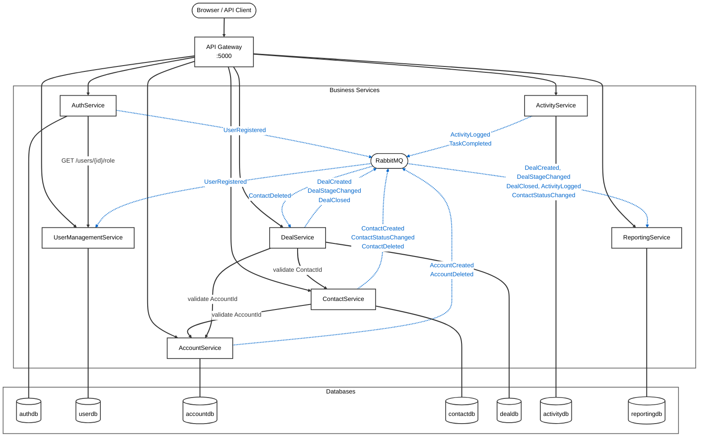

# Architecture

## Overview

A CRM-oriented microservices system built on ASP.NET Core (.NET 9). All services run behind a YARP API gateway and communicate via a combination of synchronous HTTP (when the caller cannot proceed without the result) and asynchronous messaging over RabbitMQ/MassTransit (for downstream side-effects). Each service owns its own PostgreSQL database — no shared data stores.

---

## Service Interconnection Diagram



> **Edge styles:** Solid arrows (`→`) are synchronous HTTP calls; dashed arrows (`⇢`) are asynchronous RabbitMQ messages.

---

## Services

### ApiGateway
- **Port (Docker):** `5000` → `8080`
- **Role:** Single entry point. JWT validation, CORS, rate limiting, and YARP reverse proxy routing.
- **Rate limits:** 100 req/min per IP, 200 req/min per authenticated user.
- **Auth:** Validates JWT on all routes except `/auth/*`. Admin-only routes (`/admin/*`) require the `admin` policy.

### AuthService
- **Port (dev):** HTTP `:5188` / HTTPS `:7043` | **Docker:** `:8080`
- **Role:** Login, registration (admin-only), password reset, invite flow.
- **Key endpoints:**
  - `POST /api/login` — issues a JWT (2-hour expiry) with `Email`, `UserId`, `Role` claims; fetches current role from UserManagementService at login time via `IUserRoleClient`.
  - `POST /api/registration/register` — admin-only; publishes `UserRegistered` event to RabbitMQ.
  - `POST /api/invite` — admin-only; sends invite email with 48-hour token.
  - `POST /api/password-reset` / `POST /api/change-password`
- **Publishes:** `UserRegistered`
- **Calls (sync):** `GET /api/users/{userId}/role` on UserManagementService at login

### UserManagementService
- **Port (dev):** HTTP `:5151` / HTTPS `:7158` | **Docker:** `:8080`
- **Role:** User profile lifecycle, role management, audit log.
- **Key endpoints:**
  - `POST /api/users` — create profile (called internally by MassTransit consumer)
  - `GET /api/users/{userId}` — get profile
  - `GET /api/users/{userId}/role` — role lookup (used by AuthService at login)
  - `GET /api/users/team` — lightweight projection for owner assignment dropdowns
  - `PATCH /api/users/{userId}/role` — admin-only
  - `PATCH /api/users/{userId}/status` — admin-only
  - `POST /api/users/{userId}/resend-invite` — admin-only
  - `GET /api/users/audit` — admin-only audit log
  - `GET/PATCH /api/admin/*` — routed via gateway `/admin/*`
- **Consumes:** `UserRegistered` → creates user profile with `Role=Member`

### AccountService
- **Port (Docker):** `:8080`
- **Role:** Company/account CRUD.
- **Key endpoints:** `GET/POST /api/accounts`, `GET/PUT/DELETE /api/accounts/{id}`
- **Publishes:** `AccountCreated`, `AccountDeleted`

### ContactService
- **Port (Docker):** `:8080`
- **Role:** Contact CRUD, status lifecycle (Lead → Customer), owner assignment.
- **Key endpoints:** `GET/POST /api/contacts`, `GET/PUT/DELETE /api/contacts/{id}`
- **Filter params on GET:** `status`, `ownerId`, `accountId`
- **Calls (sync):** AccountService to validate `AccountId` before creating a contact (fail-open on network error)
- **Publishes:** `ContactCreated`, `ContactStatusChanged`, `ContactDeleted`

### DealService
- **Port (Docker):** `:8080`
- **Role:** Deal CRUD, pipeline stages, deal-contact associations.
- **Key endpoints:**
  - `GET/POST /api/deals`, `GET/PUT/DELETE /api/deals/{id}`
  - `GET /api/pipeline` — Kanban board view grouped by stage
  - `POST /api/deals/{id}/contacts` — add contact association
  - `DELETE /api/deals/{id}/contacts/{contactId}` — remove contact association
- **Filter params on GET deals:** `stage`, `accountId`, `ownerId`
- **Calls (sync):** AccountService and ContactService to validate IDs before creating a deal (fail-open)
- **Publishes:** `DealCreated`, `DealStageChanged`, `DealClosed`
- **Consumes:** `ContactDeleted` → removes all deal-contact associations for that contact

### ActivityService
- **Port (Docker):** `:8080`
- **Role:** Activity CRUD (Call, Email, Meeting, Task, Note).
- **Key endpoints:** `GET/POST /api/activities`, `GET/PUT/DELETE /api/activities/{id}`
- **Filter params on GET:** `contactId`, `dealId`, `accountId`, `ownerId`, `type`
- **Publishes:** `ActivityLogged`, `TaskCompleted` (only when `Type == Task` and completing for the first time)

### ReportingService
- **Port (Docker):** `:8080`
- **Role:** Read-only. Maintains event-sourced projections; no write API.
- **Key endpoints:**
  - `GET /api/reports/pipeline` — `PipelineProjection` per deal stage (deal count + total value)
  - `GET /api/reports/activities` — `ActivityRepProjection` per owner (activity counts)
  - `GET /api/reports/contacts` — `ContactFunnelProjection` per status
  - `GET /api/reports/dashboard` — all three combined
- **Consumes:** `DealCreated`, `DealStageChanged`, `DealClosed`, `ActivityLogged`, `ContactStatusChanged`
- **Internal projections:** `PipelineProjection`, `ActivityRepProjection`, `ContactFunnelProjection`, `DealSnapshot` (used for stage-change value calculations)

---

## Gateway Routing

All external traffic enters via the API Gateway on port `5000`. YARP strips the path prefix before forwarding.

| Gateway prefix | Strips prefix | Cluster | Auth required |
|---|---|---|---|
| `/auth/{**}` | `/auth` | auth-cluster | No |
| `/users/{**}` | `/users` | users-cluster | Yes |
| `/admin/{**}` | `/admin` | users-cluster | Admin only |
| `/accounts/{**}` | `/accounts` | accounts-cluster | Yes |
| `/contacts/{**}` | `/contacts` | contacts-cluster | Yes |
| `/deals/{**}` | `/deals` | deals-cluster | Yes |
| `/pipeline/{**}` | `/pipeline` | deals-cluster | Yes |
| `/activities/{**}` | `/activities` | activities-cluster | Yes |
| `/reports/{**}` | `/reports` | reports-cluster | Yes |

---

## Asynchronous Messaging

**Broker:** RabbitMQ 3.13 (management UI on port `15672`)
**Client:** MassTransit

### Event Inventory

| Event | Publisher | Consumers |
|---|---|---|
| `UserRegistered` | AuthService | UserManagementService |
| `AccountCreated` | AccountService | _(future)_ |
| `AccountDeleted` | AccountService | _(future)_ |
| `ContactCreated` | ContactService | ReportingService |
| `ContactStatusChanged` | ContactService | ReportingService |
| `ContactDeleted` | ContactService | DealService |
| `DealCreated` | DealService | ReportingService |
| `DealStageChanged` | DealService | ReportingService |
| `DealClosed` | DealService | ReportingService |
| `ActivityLogged` | ActivityService | ReportingService |
| `TaskCompleted` | ActivityService | _(future)_ |

### Sync vs Async Decision Rule

- **Sync HTTP** — when the caller cannot proceed without the result (e.g., AuthService fetching a role at login, ContactService validating an AccountId before creating a contact).
- **Async messaging** — when the effect is a downstream side-effect that does not block the caller (e.g., creating a user profile after registration, updating reporting projections after a deal closes).

---

## Data Stores

Each service has an isolated PostgreSQL 16 database. No cross-service DB access.

| Service | Database | User |
|---|---|---|
| AuthService | `authdb` | `auth_user` |
| UserManagementService | `userdb` | `user_user` |
| AccountService | `accountdb` | `account_user` |
| ContactService | `contactdb` | `contact_user` |
| DealService | `dealdb` | `deal_user` |
| ActivityService | `activitydb` | `activity_user` |
| ReportingService | `reportingdb` | `reporting_user` |

**Schema management:** No migrations. All services call `EnsureCreated()` on startup. Navigation properties are loaded via `Include()` in repositories — no lazy loading.

Notable EF relationships:
- `DealContact → Deal` has cascade-delete configured in `DealDbContext`.
- `DealRepository.GetByIdAsync` eagerly loads `DealContacts`.

---

## Shared Libraries

The shared library is split into topic packages so services only reference what they consume.

| Package | Contents |
|---|---|
| `SharedLibrary.Auth` | `UserRole` enum (`Unassigned`, `Member`, `Admin`), Auth DTOs (`CreateUserProfileRequest`, `CreateUserProfileResponse`) |
| `SharedLibrary.Messaging` | `BaseEvent` (base class for all events) |
| `SharedLibrary.Accounts` | `AccountCreated`, `AccountDeleted` events |
| `SharedLibrary.Contacts` | `ContactStatus` enum, `ContactCreated`, `ContactStatusChanged`, `ContactDeleted` events |
| `SharedLibrary.Deals` | `DealStage` enum, `DealContactRole` enum, `DealCreated`, `DealStageChanged`, `DealClosed` events |
| `SharedLibrary.Activities` | `ActivityType` enum (`Call`, `Email`, `Meeting`, `Task`, `Note`), `ActivityLogged`, `TaskCompleted` events |

---

## Authentication & Authorization

- **Mechanism:** JWT Bearer, 2-hour expiry.
- **Claims:** `Email`, `UserId`, `Role`
- **Role resolution:** Role is NOT stored in AuthService's DB. On login, AuthService fetches the current role from UserManagementService (`GET /api/users/{userId}/role`) and encodes it into the JWT at issuance time.
- **Policies:**
  - `default` — any valid JWT
  - `admin` — JWT with `Role == Admin`
- **Password policy:** Minimum 8 characters, requires uppercase, lowercase, digit, and special character.

---

## Internal Service Patterns

### Layered Architecture (per service)

```
Controllers → Services (interfaces) → Repositories (interfaces) → EF DbContext
```

### ServiceResult Pattern

All service methods return `ServiceResult<T>`:
- `ServiceResult.Success(data, message, statusCode)`
- `ServiceResult.Failure(message, statusCode)`

Controllers call `StatusCode(result.StatusCode, result.Data ?? result.Message)`.

### HTTP Validation Clients

Services that validate foreign IDs synchronously (AccountClient, ContactClient) use `HttpClientFactory`. These clients **fail-open** on network exceptions — a downstream outage does not block the creating service.

---

## Logging & Observability

- **Structured logging:** Serilog, minimum level `Information` (Microsoft/System overridden to `Warning`).
- **Log sink (Docker):** Seq (`http://seq:5341`), UI accessible at port `5341` on the host.
- **Correlation:** Each service logs with structured properties (e.g., `{ContactId}`, `{DealId}`).
- **Health checks:** Each service exposes a `/health` endpoint backed by ASP.NET Core health checks (DB connectivity + RabbitMQ/DLQ checks).

---

## Infrastructure

### Docker Compose

All services, databases, RabbitMQ, and Seq run as Docker containers on a shared `backend` network. The gateway and Seq are also attached to a `frontend` network for external access.

Secrets are injected via environment variables (`.env` file):
- `JWT_SECRET`
- `AUTH_DB_PASSWORD`, `USER_DB_PASSWORD`, `ACCOUNT_DB_PASSWORD`, `CONTACT_DB_PASSWORD`, `DEAL_DB_PASSWORD`, `ACTIVITY_DB_PASSWORD`, `REPORTING_DB_PASSWORD`
- `RABBITMQ_USERNAME`, `RABBITMQ_PASSWORD`
- `DEFAULT_ADMIN_PASSWORD`

### Development (local, without Docker)

| Service | HTTP | HTTPS |
|---|---|---|
| AuthService | `:5188` | `:7043` |
| UserManagementService | `:5151` | `:7158` |
| ApiGateway | `:5000` | — |

---

## Testing

**Frameworks:** xUnit, Moq, FluentAssertions, Coverlet

| Layer | Tool |
|---|---|
| Unit | `Microsoft.EntityFrameworkCore.InMemory` for DbContext; Moq for interfaces |
| Integration | `WebApplicationFactory<Program>`, `Testcontainers.PostgreSql`, MassTransit test harness (`AddMassTransitTestHarness`), WireMock.Net for downstream HTTP stubs |
| E2E | `EndToEnd.Tests` — requires the full Docker stack running |

**Test counts (as of March 2026):** 377 total — 320 unit, 57 integration, 17 E2E
**Coverage:** Line 96.2%, Branch 80.7%, Method 98.6%

### Integration Test Notes

- `public partial class Program { }` must be present at the end of each service's `Program.cs` for `WebApplicationFactory<Program>` to work.
- Connection string must be set via `UseSetting("ConnectionStrings:<Name>", ...)` before `ConfigureServices` so the Npgsql health check does not throw on an empty string.
- Use `_harness.Bus.Publish()` (not a scoped `IPublishEndpoint`) when publishing from tests.
- WireMock stubs for the AuthService UMS role lookup must return a JSON object `{ userId, role: 1 }`, not a plain string.
- `Consumer_DealStageChanged_MovesDealBetweenStages` in `ReportingService.IntegrationTests` is a known flaky test that passes in isolation but occasionally fails in parallel runs.
